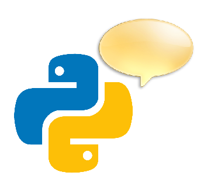
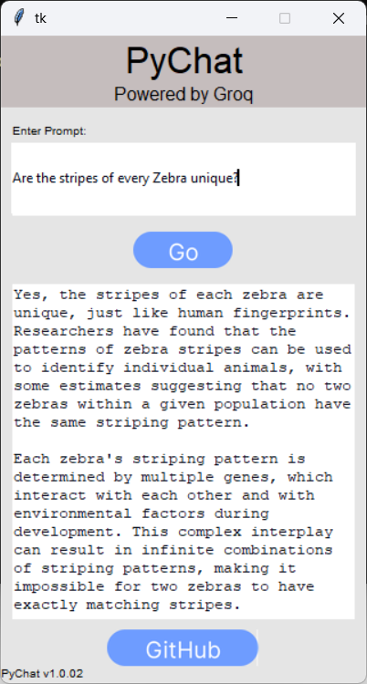

<table width="100%">
  <tr>
    <td align="left" width="120">
      
    </td>
    <td align="Left">
      <h1>PyChat</h1>
      <h3 style="margin-top: -10px;">Yours Everyday AI Assitant.</h3>
    </td>
  </tr>
</table>

## 📌 Overview
PyChat is an open-sourced, ready to use AI Assitant catered towards general/everyday questions. With Groq, the responses are quick and conversational.

## ✨ Features 
✅ Easy to use UI  
✅ Fast responses  
✅ Secure conversations (PyChat doesn't keep any logs of your chat)

## 🖼️ Screenshot

 

<em>Fig. PyChat GUI</em>

## 🛠️ Technologies Used
- **Figma**: For designing the GUI
- **Python**: Efficient coding
- **Tkinter**: Python Framework for GUI Applications
- **Groq API**: For unlimited responses

## 🧰 Getting Started
### Prerequisites
Make sure you have python 3.10 or later installed

### Setup
1. Fork the repository
2. Clone your fork locally
3. Navigate to the build directory: `cd build`
4. Run the backend.py file: `python backend.py`
5. Run the gui.py file: `python gui.py`

## 🤝 Contributing
Contributions are welcomed! Make PyChat even better by putting your expertise into it.  
Read [Contributing Guide](CONTRIBUTING.md) for more info and key focus areas.

### ❤️ Thank you for using/showing interest in PyChat 😊
